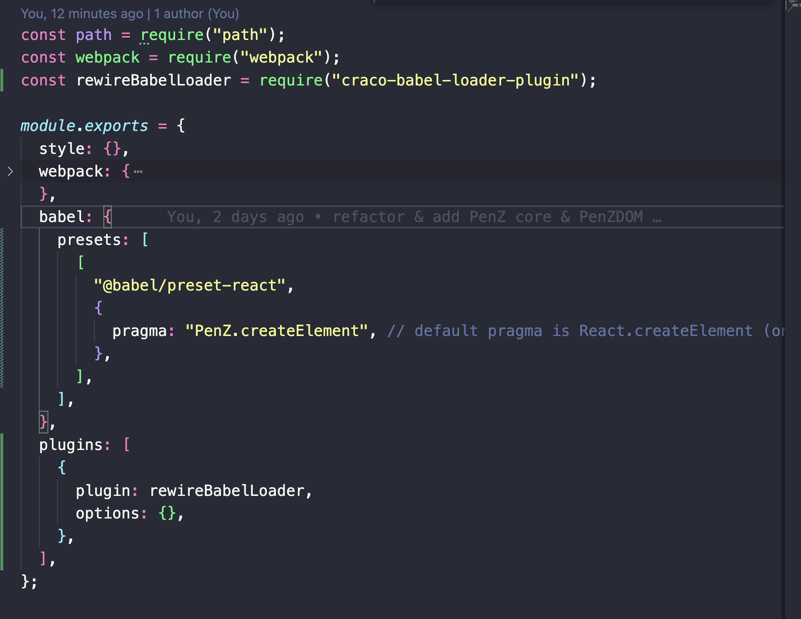

# This is a mini-React that called PenZ

## 每个git tag标签代表新增一个功能

选择每个标签来观察PenZ框架如何一步步接近React

## 小贴士

一开始，因为我不明白Craco为什么无法修改与Babel相关的配置，所以我添加了WebPack来构建此项目。一段时间后，我发现Craco可能没有使用Babel配置进行打包, 看起来好像是没有loader. 所以我去npm上搜索了craco-babel-loader-plugin,bingo!! 现在可以使用webpack或者craco来打包项目

